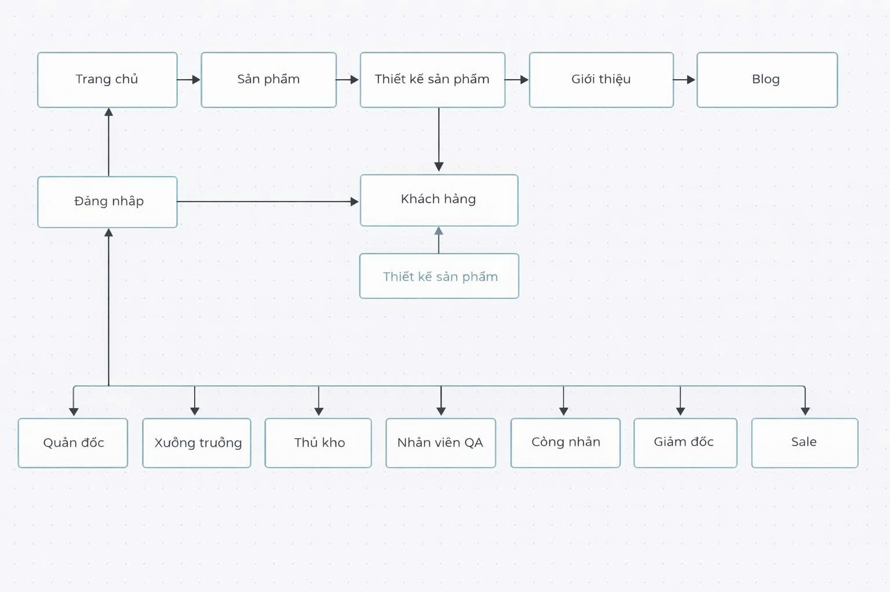

# 🧵 HỆ THỐNG QUẢN LÝ XƯỞNG SẢN XUẤT MAY MẶC  
**Garment Production Management System (GPMS)**

## 📌 Giới thiệu
Đây là đồ án môn **Phát triển ứng dụng (PTUD)** với đề tài  
**“Hệ thống quản lý xưởng sản xuất may mặc đa xưởng”**.

Hệ thống được xây dựng nhằm mô phỏng và hỗ trợ quản lý hoạt động sản xuất trong một doanh nghiệp may mặc gồm nhiều xưởng sản xuất khác nhau.  
Ứng dụng giúp quản lý sản phẩm, theo dõi quy trình sản xuất và cung cấp giao diện trực quan phục vụ công tác vận hành.

---

## 🎯 Mục tiêu đề tài
- Xây dựng hệ thống quản lý xưởng sản xuất may mặc có giao diện thân thiện.
- Quản lý thông tin sản phẩm, xưởng sản xuất và người dùng.
- Áp dụng kiến thức phân tích – thiết kế hệ thống và lập trình web.
- Rèn luyện kỹ năng làm việc nhóm và phát triển phần mềm theo mô hình MVC.

---

## 🛠️ Công nghệ sử dụng
- **Ngôn ngữ**: PHP
- **Frontend**: HTML, CSS, JavaScript
- **Backend**: PHP (MVC)
- **Cơ sở dữ liệu**: MySQL
- **Server**: Apache (XAMPP)
- **Quản lý mã nguồn**: Git & GitHub

---

## 👥 Thành viên thực hiện
- **Vỹ Hào**
- **Văn Duy**
- **Ngọc Hiếu**
- **Quang Diễn**
- **Ngọc Hào**

> Nhóm: **App Masters Group**

---

## 👩‍🏫 Giảng viên hướng dẫn
- **Cô Lê Thùy Trang**

🗺️ Sitemap

Sơ đồ sitemap được thiết kế nhằm mô tả tổng quan các chức năng và luồng điều hướng của hệ thống.
## 🗺️ Sitemap
Sơ đồ sitemap được thiết kế nhằm mô tả tổng quan các chức năng và luồng điều hướng của hệ thống.

📚 Nguồn tham khảo

https://dony.vn/thoi-trang/
https://dirtycoins.vn/
Các hình ảnh chỉ phục vụ mục đích học tập và minh họa cho đồ án, không sử dụng cho mục đích thương mại.

❤️ Lời cảm ơn

Nhóm xin chân thành cảm ơn Khoa và Giảng viên bộ môn PTUD, đặc biệt là Cô Lê Thùy Trang, đã tận tình hướng dẫn và hỗ trợ nhóm trong suốt quá trình thực hiện đồ án.
